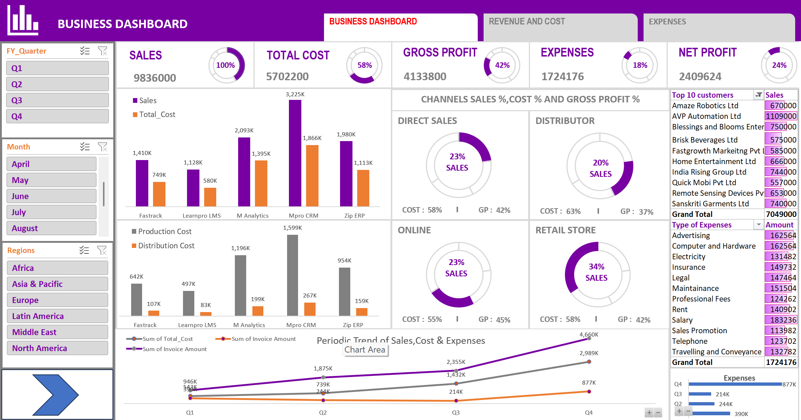
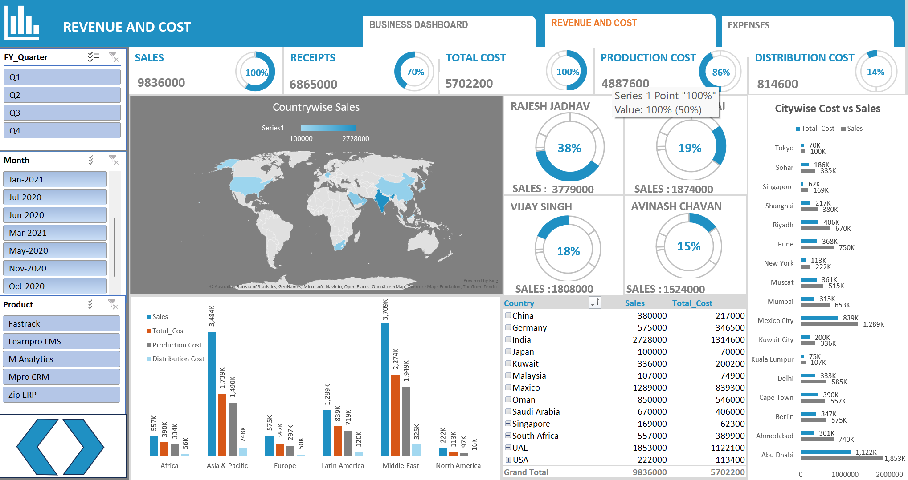
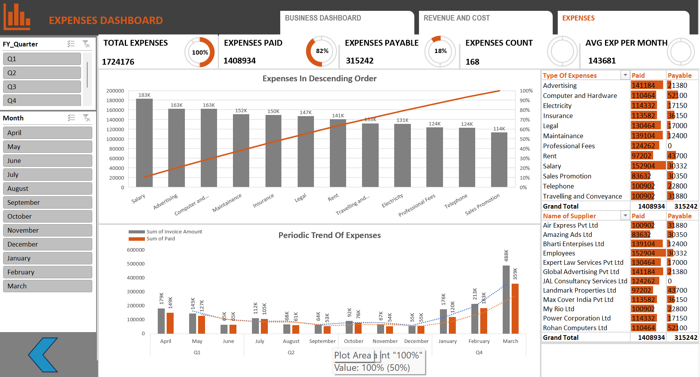

# Business Performance Analysis Dashboard using Excel

This project analyzes business performance using **Sales, Cost, and Expense data**.  
The Excel dashboards provide insights into **revenue trends, cost distribution, supplier spending, and overall profitability**.

---

## Dashboard Preview

### Business Dashboard

### Revenue & Cost Dashboard

### Expenses Dashboard

---

## Tools Used
- Microsoft Excel
- Power Query
- Power Pivot
- Pivot Tables
- Pivot Charts
- Excel Data Model
- Slicers

---

## Dataset Tables
- Customers
- Quarterly Sales
- Expenses
- Cost
- Calendar

---

## Key Metrics
- Sales
- Total Cost
- Gross Profit
- Net Profit
- Expenses Paid
- Expenses Payable
- Production Cost
- Distribution Cost
- Average Expense per Month
